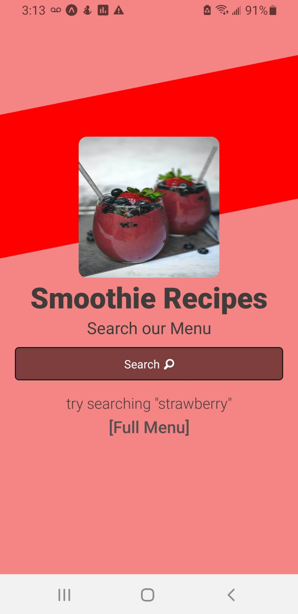
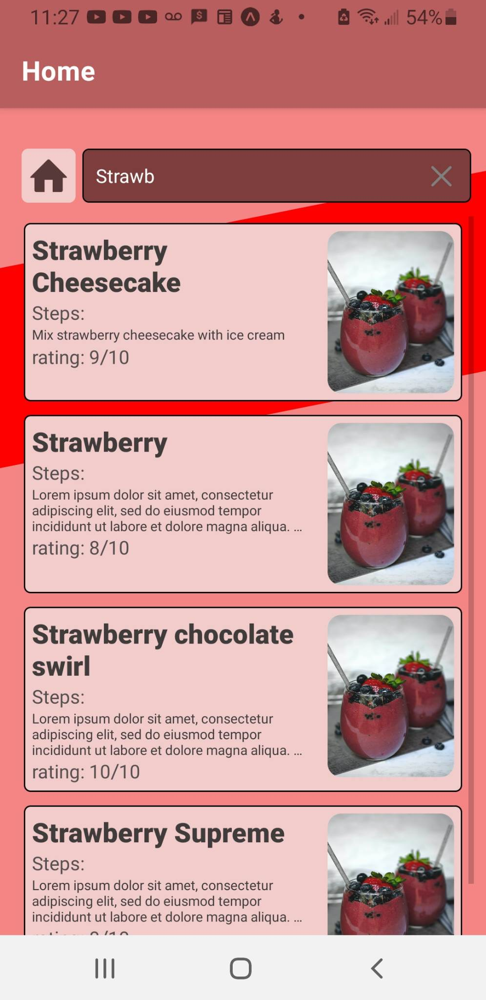

# Smoothie Search React Native App
* The purpose of the app is to use throttling when typing on the searchbar and pulling up relevant data with api calls
* You will need a supabase database with environment variables set up in an .env file for the app to work

### Will Look like the following:
:::
  :::
    
  :::
  :::
    
  :::
:::

## Supabase database
* Can be found the in supabase folder of the project
* App searchbar will not run without the supabase Connection
* The _import "react-native-url-polyfill/auto";_ in App.js is needed due to an error that appears
* environment variables are pulled using _import { REACT_APP_SUPABASE_URL, REACT_APP_ANON_KEY } from "@env";_
* the .babelrc file was created to account for the environment variable in the .env file
```
{
  plugins: [
    [
      "module:react-native-dotenv",
      {
        envName: "APP_ENV",
        moduleName: "@env",
        path: ".env"
      }
    ]
  ]
};
```

* info on environment variables can be found here: https://blog.logrocket.com/understanding-react-native-env-variables/
* the supabase.js file is where I create the client and export it to other files
```
import { createClient } from "@supabase/supabase-js";
import { REACT_APP_SUPABASE_URL, REACT_APP_ANON_KEY } from "@env";
const supabase = createClient(REACT_APP_SUPABASE_URL, REACT_APP_ANON_KEY);
export default supabase;
```
* The table on supabase has the following columns: 
    * id(int8)
    * created_at(timestamptx)
    * title(text)
    * method(text)
    * rating(int8)


## Custom Hooks can be found in the utils folder

### useIsSearchBarActive
* Uses a listener for the Keyboard object from the "react-native" library. This is to address the issue of the focus on the Textinput element. 
* The issue can be found here: https://github.com/facebook/react-native/issues/33532
* The listener is placed in a useEffect so it can be removed when not in use on the return.
* The custom hook also returns the active state and the handler to change it and the ref and the actual ref itself.

### useDebounce and useThrottle
* In the app I use the throttle instead of the debounce
* I followed the format from this link: https://www.codingdeft.com/posts/react-debounce-throttle/
* I rearranged the code so that it works with the supabase database
* What's left to do is use fuzzy text search instead of textSearch to improve searching
* I am looking into supabase extensions to get this result

The timing for the throttle or debounce is found at the end of the setTimeout and is set to 600 miliseconds

```
    setTimeout(() => {
      throttling.current = false;
      const fetchSmoothies = async () => {
        [CODE...]
      };
      fetchSmoothies();
    }, 600);
```

###  useLog
* It uses a useEffect to console.log the data whenever there's a change. Not needed in production.


## Home page

### TitlePic component goes away when there are search Results
```
{smoothies.length === 0 && <TitlePic />}
```

### The main View changes style from justifyContents:*"center"* to *"flex-start"* when there are results
```
    <View
      style={
        smoothies.length === 0 ? styles.container : styles.containerAltered
      }
    >
        [code]...
    </View>
```

### Search Bar
* The most complex component in the app. In the future, I may make a searchBarContainer component to simplify the code and handles the useIsSearchBarActive hook there
* takes in the inputRef, active, handleActive returned from the custom hook useIsSearchBarActive
* takes in state and handlers for text, smoothies
* takes in the searchHandler which can either be the debounce or throttle returned from the useDebounce and useThrottle, respectively.


```
      <SearchBar
        smoothies={smoothies}
        text={text}
        active={active}
        inputRef={inputRef}
        handleText={handleText}
        handleActive={handleActive}
        handleSmoothies={handleSmoothies}
        handleSearch={handleThrottleSearch}
      />
```

### SmoothieList component appears when there are search Results
```
      {smoothies.length > 0 && (
        <SmoothieList smoothies={smoothies} text={text} />
      )}
```

### BottomText component goes away when there are search Results
```
{smoothies.length === 0 && <BottomTextHome />}
```


